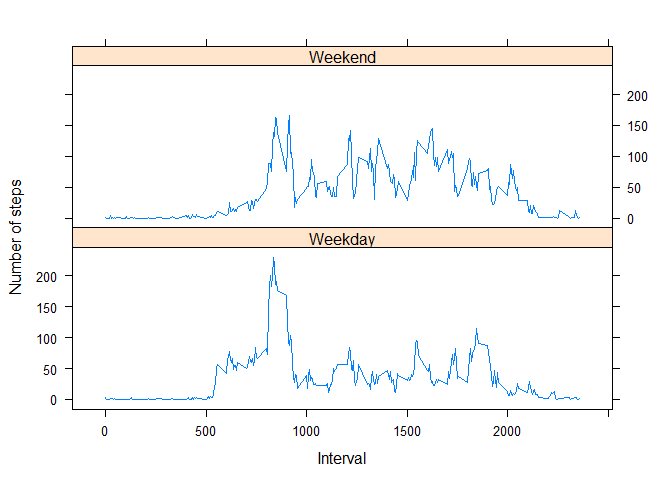

*Loading and preprocessing the data*

*Show any code that is needed to*

*1. Load the data (i.e. read.csv())*

    activity <- read.csv("activity.csv", header = TRUE)

*2 Process/transform the data (if necessary) into a format suitable for
your analysis*

    library(plyr)

    ## -------------------------------------------------------------------------

    ## You have loaded plyr after dplyr - this is likely to cause problems.
    ## If you need functions from both plyr and dplyr, please load plyr first, then dplyr:
    ## library(plyr); library(dplyr)

    ## -------------------------------------------------------------------------

    ## 
    ## Attaching package: 'plyr'

    ## The following objects are masked from 'package:dplyr':
    ## 
    ##     arrange, count, desc, failwith, id, mutate, rename, summarise,
    ##     summarize

    library(dplyr)
    library(tidyr)
    library(knitr)
    summary(activity)

    ##      steps                date          interval     
    ##  Min.   :  0.00   2012-10-01:  288   Min.   :   0.0  
    ##  1st Qu.:  0.00   2012-10-02:  288   1st Qu.: 588.8  
    ##  Median :  0.00   2012-10-03:  288   Median :1177.5  
    ##  Mean   : 37.38   2012-10-04:  288   Mean   :1177.5  
    ##  3rd Qu.: 12.00   2012-10-05:  288   3rd Qu.:1766.2  
    ##  Max.   :806.00   2012-10-06:  288   Max.   :2355.0  
    ##  NA's   :2304     (Other)   :15840

*What is mean total number of steps taken per day?*

*For this part of the assignment, you can ignore the missing values in
the* *dataset.*

We take out missing values (NAs in the 'steps' variable) and assign it
the a new variable ('activityCleaned')

    activityCleaned <- na.omit(activity)

*1. Calculate the total number of steps taken per day*

After cleaning the data frame, we use the newly obtained one
(activityCleaned) to calculate sum of steps per each day and recorded it
a new Vairable ('SumStepsperDay')

    SumStepsperDay <- group_by(activityCleaned, date) %>% summarise(sum(steps))
    SumStepsperDay

    ##   sum(steps)
    ## 1     570608

*2. Make a histogram of the total number of steps taken each day*

    hist(SumStepsperDay$`sum(steps)`, freq = TRUE, main = "Histogram for total steps per each day", xlab = "Total no of steps in a day", ylab = "Frequency (no of days with a total no of steps taken)", plot = TRUE)

*3. Calculate and report the mean and median of the total number of
steps taken per day *

We record in a list only the sums of steps per each day
('StepsperDayOnly"). We then apply the formulas to calculate mean and
median for 'StepsperDayOnly'

    StepsperDayOnly <- SumStepsperDay$`sum(steps)`
    mean(StepsperDayOnly)

    ## [1] 570608

    median(StepsperDayOnly)

    ## [1] 570608

*What is the average daily activity pattern?*

*Make a time series plot (i.e. type = "l") of the 5-minute interval
(x-axis)* *and the average number of steps taken, averaged across all
days (y-axis)*

    IntStepsMean <- activityCleaned %>% group_by(interval) %>% summarize(mean(steps))
    plot(IntStepsMean, type = "l")

    ## Warning in plot.window(xlim, ylim, log, ...): graphical parameter "type" is
    ## obsolete

    ## Warning in axis(side = side, at = at, labels = labels, ...): graphical
    ## parameter "type" is obsolete

    ## Warning in title(xlab = xlab, ylab = ylab, ...): graphical parameter "type"
    ## is obsolete

*Which 5-minute interval, on average across all the days in the dataset,
* *contains the maximum number of steps?*

We use the previously grouped data by intervals and calculated the steps
mean by intervals in the 'IntStepsMean'. We select and read the row with
max mean, where this max appears and find the respective interval which
is 835 (thus 8:35 to 8:40).

    IntStepsMean[which.max(IntStepsMean$`mean(steps)`),]

    ## [1] 37.3826

*Imputing missing values*

*Note that there are a number of days/intervals where there are missing
values* *(coded as NA). The presence of missing days may introduce bias
into some* *calculations or summaries of the data.*

*1.Calculate and report the total number of missing values in the
dataset (i.e.* *the total number of rows with NAs)*

We calculate the number of NAs with the helps of is.na function, assign
the result to a variable called 'activityNAs' (in case the value is
needed further) and print this vaiable value (2304) in the same line
with the help of print function.

    print(activityNAs <- sum(is.na(activity$steps)))

    ## [1] 2304

*2. Devise a strategy for filling in all of the missing values in the
dataset.* *The strategy does not need to be sophisticated. For example,
you could use* *the mean/median for that day, or the mean for that
5-minute interval, etc.*

We will use the specific 5 mintue interval steps mean calculated across
all the days and replace the NA values of the steps with this mean.

*3. Create a new dataset that is equal to the original dataset but with
the * *missing data filled in.*

We have read the file into w new variable called activityUpdated and
then rewritten this variable by replacing the NA values with the mean of
the steps across all days for that 5 minute interval.

    activityUpdated <- read.csv("activity.csv", header = TRUE)
    i <- 1
    repeat {
      if (is.na(activityUpdated[i, which(colnames(activityUpdated) == "steps")])) 
            {
              activityUpdated[i, which(colnames(activityUpdated) == "steps")] <- 
                filter(activityUpdated, interval == activityUpdated[i,
                which(colnames(activityUpdated) == "interval")]) %>%
                  summarise(mean(steps, na.rm = TRUE))
            }
      i <- i+1
      if (i > nrow(activityUpdated)) break
    }

*4. Make a histogram of the total number of steps taken each day and
Calculate* *and report the mean and median total number of steps taken
per day. Do these* *values differ from the estimates from the first part
of the assignment? What* *is the impact of imputing missing data on the
estimates of the total daily* *number of steps?*

    SumStepsperDayUpdated <- group_by(activityUpdated, date) %>% summarise(sum(steps))
    hist(SumStepsperDayUpdated$`sum(steps)`, freq = TRUE, main = "Histogram for total steps per each day", xlab = "Total no of steps in a day", ylab = "Frequency (no of days with a total no of steps taken)", plot = TRUE)

    StepsperDayOnly2 <- SumStepsperDayUpdated$`sum(steps)`
    mean(StepsperDayOnly2)

    ## [1] 656737.5

    median(StepsperDayOnly2)

    ## [1] 656737.5

Due to the way we did NAs replacing (means by intervals across al days),
as expected, the new mean and median are equal and also the same with
the mean in the first part: 10766.19

*Are there differences in activity patterns between weekdays and
weekends?*

*For this part the weekdays() function may be of some help here. Use
the* *dataset with the filled-in missing values for this part.*

*1. Create a new factor variable in the dataset with two levels ???
???weekday???* *and ???weekend??? indicating whether a given date is a
weekday or weekend day.*

We create a new column using mutate in order to obtain days of the week
with the help of the weekdays() function and then a separate column
based on the previous were we include weekend vs weekday labels.

    activityUpdatedWEEK <- mutate(activityUpdated, DayInTheWeek = weekdays(as.Date(date)))
    activityUpdatedWEEK$PartOfWeeK <- ifelse(activityUpdatedWEEK$DayInTheWeek == "Saturday" | activityUpdatedWEEK$DayInTheWeek == "Sunday", "Weekend", "Weekday")
    activityUpdatedWEEK$PartOfWeeK <- factor(activityUpdatedWEEK$PartOfWeeK)

*2. Make a panel plot containing a time series plot (i.e. type = "l") of
the* *5-minute interval (x-axis) and the average number of steps taken,
averaged* *across all weekday days or weekend days (y-axis). See the
README file in the* *GitHub repository to see an example of what this
plot should look like using* *simulated data.*

    library(lattice)
    groupedByIntervalWeekDay <- ddply(activityUpdatedWEEK, ~interval + PartOfWeeK, summarise, 
        mean = mean(steps))
    groupedByIntervalWeekDay$interval <- as.numeric(as.character(groupedByIntervalWeekDay$interval))
    xyplot(mean ~ interval | PartOfWeeK, groupedByIntervalWeekDay, type = "l", 
        layout = c(1, 2), xlab = "Interval", ylab = "Number of steps")

